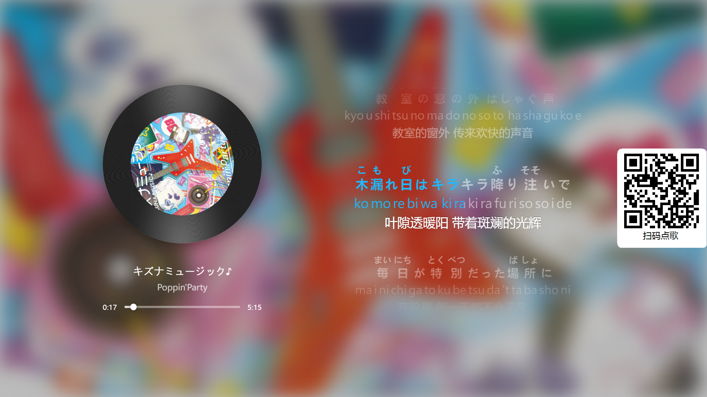
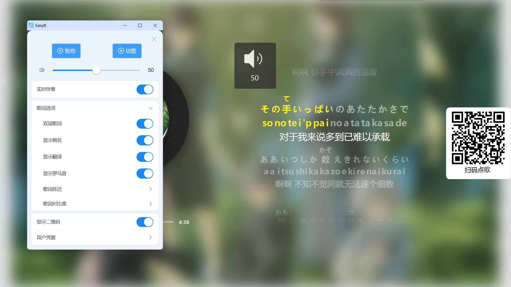
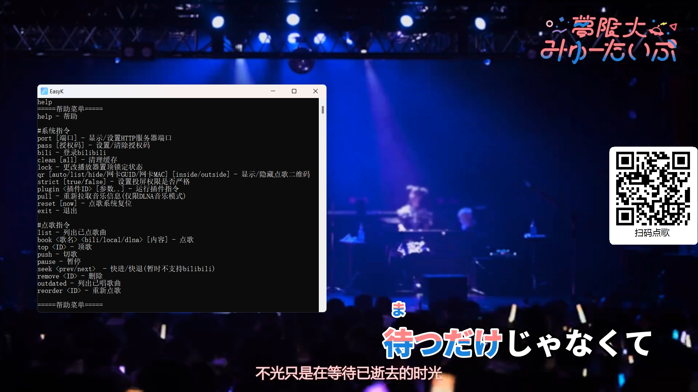

# EasyK

**轻松随地大小K**

## 🌟当前版本🌟 ➡️ [✌v1.1.2🐯](https://github.com/li-yuan-fang/EasyK/releases/tag/v1.1.2)



## 为什么要做这个

众所周知，大部分的KTV歌都不多，很多小众歌覆盖不到，而且不少都不能像纯K那样简单的投屏，更有甚者声称**能投屏**但是一堆广告而且投出来到电视上永远是竖屏😡😡😡

不过最近发现有不少KTV可以插线投屏（也就是允许你用电脑插HDMI线），为了解决投屏麻烦和点歌次序的问题，随手开发了这个小工具😋



## 所以有什么功能

✅能扫码排队点歌

✅支持上传视频

✅支持B站直接播放

✅支持DLNA投屏（纯K那种）

✅DLNA投屏纯音频时自动生成界面

✅实时生成伴奏（音源有人声可以自动消除）

✅投屏不会切歌

✅投屏可以开防插队功能（只有点歌的人能投）

✅在家也可以直接把电脑当点歌机用

## 要怎么用

参考➡️[**⭐用户指南⭐**](https://github.com/li-yuan-fang/EasyK/wiki/EasyK-%E7%94%A8%E6%88%B7%E6%8C%87%E5%8D%97)



## TODO

- [ ] 优化使用体验

- [ ] 尝试引入新的伴奏处理方案

- [ ] ~~修Bug~~
  
  

**⚠️以下为技术内容⚠️**

## 技术特性

- 基于[.Net Framework 4.8](https://go.microsoft.com/fwlink/?linkid=2088631)开发的WinForm程序

- 使用[Kestrel](https://learn.microsoft.com/zh-cn/aspnet/core/fundamentals/servers/kestrel)作为HTTP服务端

- 使用[CEFSharp](https://github.com/cefsharp/CefSharp)作为内置浏览器（实际使用CEFSharp.H264发行版）

- 使用[LibVLCSharp](https://github.com/videolan/libvlcsharp)作为内置播放器

- 点歌界面使用[Vue 3](https://cn.vuejs.org/)和[Vant组件库](https://vant-ui.github.io/)实现

- 理论上支持Windows 7及以上版本系统

## 如何编译

1. 编译[内置音乐播放器](https://github.com/li-yuan-fang/easyk-musicbox/)为静态页面

2. 将编译好的播放器静态页面复制到主程序源代码目录下的```wwwroot/dlna```目录

3. 编译EasyK主程序

4. 复制支持H264的CefSharp库到输出目录并替换（可参考[cefsharp.H264.x64.109（88、84、79）可播放视频包免费编译版](https://www.cnblogs.com/wintertone/p/18416085)和[编译带H.264的cef(windows)](https://zhuanlan.zhihu.com/p/694014974)）

> 主分支CefSharp版本已升级到126.2，Win7特供版仍然使用109.1.110

5. 编译[前端页面](https://github.com/li-yuan-fang/easyk-frontend/)为静态页面

6. 在输出目录创建子目录**wwwroot**，并将编译好的前端页面复制进去

7. Enjoy

## 参考了这些

[Macast](https://github.com/xfangfang/Macast/)

[Universal Plug and Play Device Architecture](https://upnp.org/specs/arch/UPnP-arch-DeviceArchitecture-v1.1.pdf)

**还有很多零星的参考资料，太多了没办法一一列举见谅**
